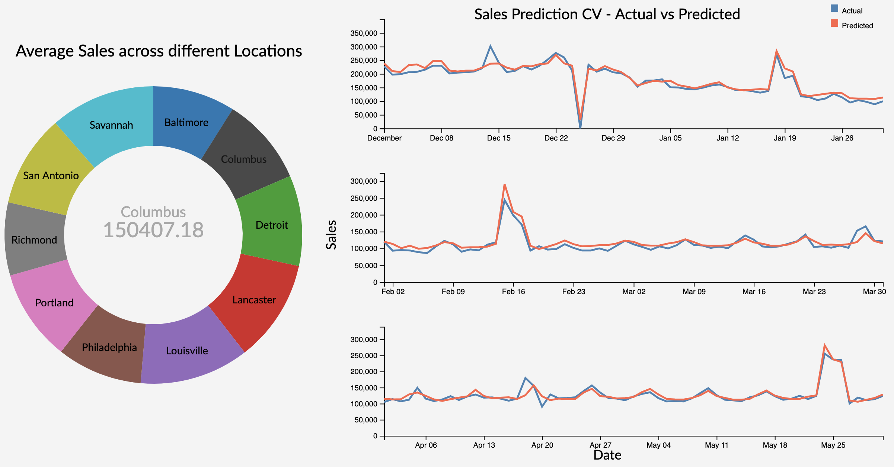

# Time Series Analysis on Sales Data

---

Sales forecasting is one of the most common time series analysis problems. Being able to estimate the number of products that a store going to sell in future will allow store managers to prepare the inventory, the number of employees needed minimizes over and under stocking thereby minimizing losses and most importantly maximizes sales and customer satisfaction.

The web application provides an interface by which data scientists or store managers can use past sales data to forecast it from a selected date. In addition to allowing the user to retrain and tune three different time series models, the application also displays the model performance, past information and forecasted predictions visually.

### Getting Started
---
Install the dependencies for the web application using the python [requirements file](https://github.com/srjit/sales-time-series-analysis/blob/master/src/app/requirements.txt) by the command

```
pip install -r requirements.txt
```

### Retraining Models
---

Following are the descriptions of the hyperparameters for each model integrated into the application

- ARIMA

	* p - the number of autoregressive terms
	* q - the number of lagged forecast errors in the prediction equation.
	* d - the number of nonseasonal differences needed for stationarity
	
- XGBoost

	* learning_rate - Boosting Learning Rate. 
	* max_depth - Maximum tree depth for base learners.
    * n_estimators - Number of trees to fit.
  
- LSTM

	* learning_rate - learning rate of the optimizer. The default value is 0.01
	* optimizer - Optimizer used for the lstm model. This could be either sgd, rmsprop, adam. Adam seems to be the optimizer that provides best values for the metrics used.

### Visual Outputs
---

#### Model Performance



<p align="justify"> Doughnut chart describes the historical average sales at different stores. As the Store is an categorical variable, each value is encoded using a different color attribute. The arc length of each slice is proportional to the average sales of a particular location. The location lebel on each arc provide initial overview to the user on what each arc represents. On hovering over each location, we get the average sales of that store displayed in the area of inner circle with the location which provides on demand details. </p>

<p align="justify"> Onclick on the hovered store, links to the model performance evalution (Time Series Cross Validation) plot using line charts for that particular store using user selected model. </p>

<p align="justify"> Multiple line charts describe the model performance using forward validation of a particular store. This approach uses the input from user on the initial train end date, until which, data is considered to be as part of training data and next two months as the validation data (validation window period = 2 months). In the next step, we consider data until validation end date in first step to be part of trainig data (training data increased by 2 months) and next two months as validation data. This will be repeated for one more step. This is considered to be a practical approach as we validate and retrain model using the future data in real world. </p>

<p align="justify"> As the Sales and Time are quantitative variables, we have used position as channel which is ranked first in effective channel ranking by datatype for quantitative variables. As we have two attributes Actual and Predicted sales over the Y-axis, we used two different colors to encode the attributes where 'steelblue' represents the actual sales and 'tomato' represents the predicted sales value. This plot uses simple and effective ways to visualize the model performace as it makes use effecitve channels, marks, avoids the extra unnecessary dimension and minimizes the occlusion by using only to attributes at a given time. </p>

 
#### Area Plot for Visualizing Historic Data


The stacked area chart describes about the historical sales data for all the stores. Each store is encoded using a color attribute and it is aggregated month-wise. On Hovering over the Area plot on a particular store, we can get the details of the sales in a store for a particular day.
	
An Onclick on the selected store links to the sales forecast for the next 7 days after the forecast start date for a particular selected store.
	
#### Forecasting Predicitons

The waterfall plot provides a visualization of the predictions from the models integrated to the applications. The forecast date can be provided as one of the user inputs while the model is being trained/re-trained. 

The plot shows the variation of prices (up/down) and the percentage change in the prices from the prices from the previous day. An increase in sales is represented by a gray bar whereas a decrease is represented by an yellow bar.
 
### Running the app locally
---

Once the dependencies are installed, the app can be run locally with the command `flask run`. 

### Deployment
---

The app has been deployed on a heroku server at: [Sales Analyzer](https://sales-ts-forecast.herokuapp.com/)

### Information
---
The development process of the project along with more information on the modeling and visualizations can be found at [Sales Analyzer Information](https://github.com/srjit/sales-time-series-analysis/tree/master/docs)
