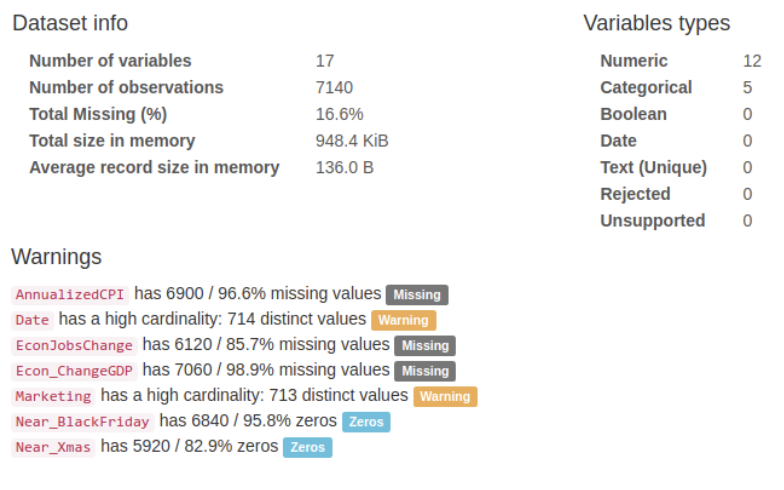
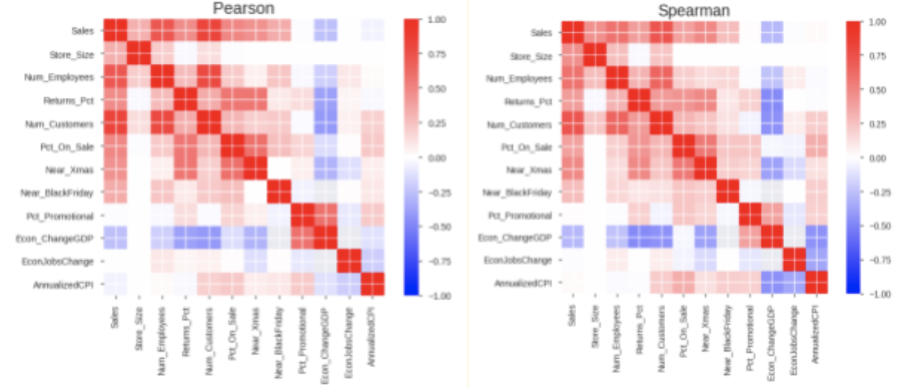
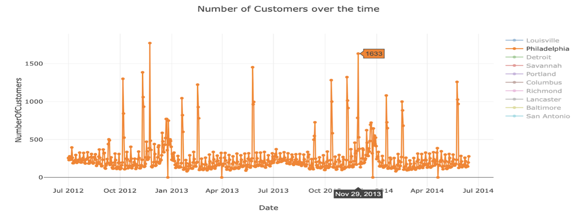
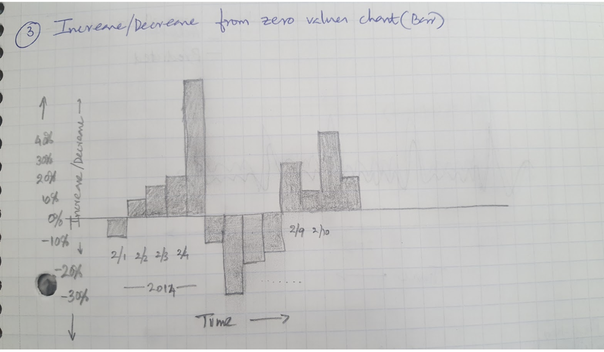
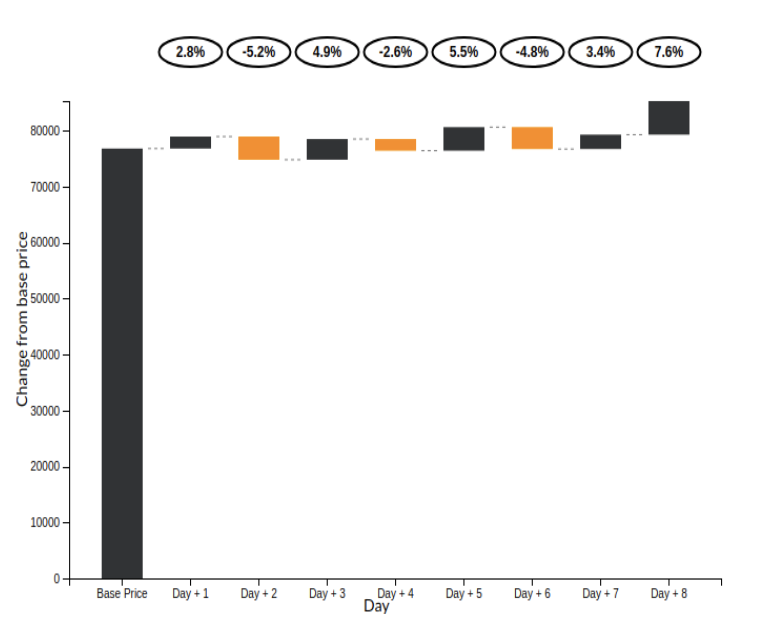
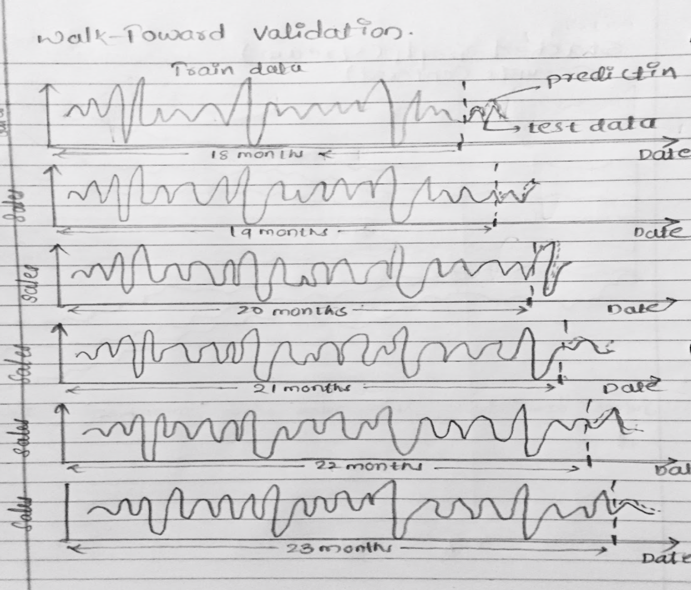
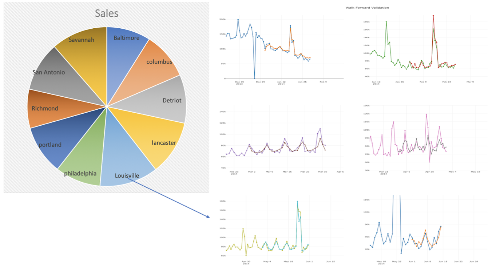
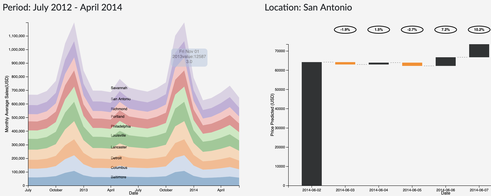

# Time Series Analysis on Sales Data

### Motivation
---

 Time series prediction problems pose an important role in many domains and multi-series (More than one time series), multivariate (multiple predictors) and multi-step forecasting like stock price prediction of different symbols could help people make better decisions. However, these problems are quite hard to solve. 

 Retail is an important business domain for data science and data mining applications. Sales forecasting is an essential task in retail stores. Being able to estimate the number of products that a store going to sell in future will allow store managers to prepare the inventory, the number of employees needed minimizes over and under stocking thereby minimizing losses and most importantly maximizes sales and customer satisfaction. Therefore forecasting sales taking into account all of the factors becomes essential. 

 Given the background, we would like to analyze and identify the factors that affect the sales and predict patterns in the same for different stores over time. We make use of the sales data of 10 stores over the time period of 2 years and work towards forecasting future sales. 

We aim to approach this problem from two different perspectives:

- Treating the prediction of sales purely as a time series analysis and forecast sales using Autoregression Integrated Moving Average (ARIMA), LSTM and see how these two models could increase the forecasting accuracy.

- Viewing the problem as a Supervised Machine Learning problem by taking lags and calculating moving averages both on target and features. we would like to compare the relative performance of XGBoost to above time series models.

 we would like to design a web application that provides an interface by which data scientists or store managers can use past sales data to forecast it from a selected date. In addition to allowing the user to retrain and tune three different time series models, the application also displays the model performance, past information and forecasted predictions visually. 

### Dataset
---

The dataset is sample sales information of 10 different stores over the time of 2 years from DataRobot Inc.

Features Available:

| Feature Name      | Data Type  | Description                                                                |
|-------------------|------------|----------------------------------------------------------------------------|
| Store_Location 	| String     | Different locations of the store [Categorical]							  |
| Date 				| Date/Time  | Year, month and day of the sales of the stores [Quantitative]              |
| Sales 			| Float      | Sales of different stores over time [Quantitative]                         |
| Store_Size 		| Integer    | size of the store [Quantitative]                                           |
| Num_Employees 	| Integer    | Number of employees on that particular date and store [Quantitative].      |
| Returns_Pct		| Float      | Return percentage [Quantitative]                                           |
| Num_Customer		| Integer    | Number of Customers in a store and on a particular Date [Quantitative]     |
| Pct_On_Sale 		| Float      | Percentage on Sale [Quantitative]                                          |
| Marketing			| Text       | Discount Information of the store on a date [Text]                         |
| Near_Xmas			| Integer    | If a particular day is near to Christmas [Categorical]                     |
| Near_BlackFriday	| Integer    | If a particular day is near to Black Friday [Categorical]                  |
| Holiday			| String     | If a particular is a Holiday or not [Categorical]                          |
| Destination_Event	| String     | If there is a destination event on that particular day or not [Categorical]|
| Econ_ChangeGDP	| Float      | Change in economy GDP [Quantitative]                                       |
| Econ_JobsChange	| Float      | Change in jobs [Quantitative]                                              |
| Annualized_CPI 	| Float      | Annual Consumer Price Index (CPI) [Quantitative]                           |

#### Data Preprocessing

The following operations were done on the raw data as a part of the cleanup process:

- Typecasting Features (For Instance: Date).

- Conditional processing of features Holiday and Destination_Event to numeric from string to numeric.

- One-Hot encoding of categorical features.

- Normalizing the quantitative features.

- Character count for text features as a new feature.

- Imputing Missing values for quantitative features Econ_ChangeGDP, Econ_JobsChange, Annualized_CPI using forward filling as these are an economic indicator which will remain same.

### Exploratory Data Analysis
---

We performed profiling of all the variables used in the analysis for the distributions of numeric features, unique values of categorical features, and correlations.

We also brought week as a variable in our analysis from the date and looked at the variation of sales prices over the three years with heatmaps. The anticipated climb in sales during the weeks of November/December can be easily observed here.

To be able to study the trend in features like ‘Num_Employees’ and ‘Num_Customers’ over the time especially during Black Friday and Christmas for a given store, we have visualized the data using plotly. Below we can see the Number of employees required climbs up during the holidays season to able to help high volume of customers needs.

### Task Analysis
---

|Domain Task | Analytic Task (Low Level) | Search Task (Mid Level) | Analyze Task (High Level) |
|------------|---------------------------|-------------------------|---------------------------|
|Examine if the sales prices will rise or fall | Identify | Lookup | Present |			
|Compare the projected sales per store | Compare |	Lookup | Present/Derive |
|Compare the trained model's performance with actual sales prices | Compare	| Lookup | Derive |
|Compare the rise or fall of sales price from a previously set base price | Compare	| Lookup | Derive |
|Sales predictions of a given store over time (Days/Weeks) | Filter | Lookup | Derive |
|Trend in sales of different stores at a given point of time |	Identify | Lookup | Present |
|Comparision of Sales between of a given stores (Actual/Predicted) | Compare | Lookup | Present/Derive |
|Number of Employee needed at different times of an year given a store | summarize | Lookup | Present |
|Number of Customers at different times of an year given a store | summarize | Lookup | Present |
|Amount of Sales during black friday and christmas (Actual/Predicted) |	Compare | Lookup | Present/Derive |
|Feature contibuting positively for the sales prediction | Identify | Locate | Derive |

### Model Description
---

#### LSTM

 Long short term memory is a modification of the vanilla recurrent neural networks. LSTMs can process entire sequences of data (such as speech or video). This sequence learning capability is LSTM the reason it became a choice for our time series modeling.

 Since the size of our dataset is small, walk forward validation has been employed for performance comparison and tuning of our models. The modeling for  LSTM has been conditioned on the store. The sales data of a store between the durations from the beginning date until 2014-01-01, 2014-02-01, 2014-03-01, 2014-04-01, and 2014-05-01 has been used for training and the rest of the data has been used in testing during the walk forward cross-validation. The sequence model with 3 LSTM layers has been able to obtain an average RMSE of 18116.48.

#### ARIMA

 An autoregressive integrated moving average, or ARIMA, is a statistical analysis model. It is a  forecasting technique that projects the future values of a series based entirely on its own inertia. We have decomposed the dataset into different components like trend, seasonality, residual. Then the data is made stationary using differentiation.

 We have used the first 18 months as a part of the training data and the next 6 months as a part of the testing data. The RMSE  is calculated for each store and we have obtained an average RMSE of 18565.45  with considering only the Sales as a time-dependent feature.

 A different approach of using ARIMA  is experimented by considering multiple features of the store but the RMSE did not see any improvement.

#### XGBoost

 XGBoost is a gradient boosting algorithm. It is also known as regularized boosting which has a good bias-variance tradeoff to reduce overfitting (which lacks in GBM). In order to use the supervised machine learning algorithms on time series data, we have used feature engineering techniques to extract time-related features like dayofweek, quarter, year, month, day. Also to capture the seasonality of the data, we have created Moving Averages and lags of different time windows which are extracted using autocorrelation. At the end of the feature engineering, we have below. 

- Time-related Features (DayOftheWeek, WeekOftheYear, Quarter)

- Seasonality Features (Lags, Moving Averages, Difference)

- Static Features (like holiday, destination event, nearXmas) 

 We used the first 18 months of data as part of training dataset and last six months as the test dataset. For model evaluation, we have used root mean square error (RMSE).  In the initial model design we have considered all the extracted and static features until the present day (i.e., to predict the sales at time ‘t’ we used features until time ‘t’), which resulted in a better model performance with RMSE value of 6138.18 for XGBoost model. As suggested, we have restricted the features to time step ‘t-1’ (i.e., to predict sales at ‘t’ we gave the features until time step ‘t-1’ as input to model) and observed increase in RMSE value to 6956.57 on test data.

 To have a better understanding of the model performance variability we have used forward validation (explained more in the next section) where we received an average RMSE value of 6131.95.

### Design Process
---

 After reviewing the task analysis and from our group discussions, we came to the conclusions that there would be two primary purposes the visualizations we build. The first would be to “present” - the predictions of the model and derive insights from them. These would be the primary output of the time series forecasting application. The secondary purpose would be “discover” - to ensure the quality of models. 

#### Consumers of our visualizations

There would be two types of consumers for our visualizations:

- Data Analyst (s) / Data Scientist(s) - People who can infer the visualization and derive conclusions on the performance of the model.

- Store Managers - People who would be looking at the sales prediction visualizations from the model and optimizing their resources in accordance with them.

####  Iterative Improvement

- Stacked Area Chart

 The original sketch is to show multiple area plots having a shared x-axis. Instead of having multiple area charts, a stacked area chart is chosen to visualize the historical sales data across all the stores over time .The idea is to see the sales across different stores at the same time. Store being the categorical feature we have encoded each value with different color to show the variations. 

- Waterfall Chart 

 The original sketch demonstrated to plot the daily variation of prices from a base price, in the up or down direction. Instead of this idea, a waterfall model plot will be used. The plot will show the increase or decrease in price from the previous day, keeping the previous day as the baseline. The bars in the plot will be encoded in two colors, showing the rise or fall from the previous day’s sale. In addition, the plot will also present the percentage of increase in price from the previous day above the bars. 

- Validation Chart

 We have used Forward validation technique to evalute the time series data. The initial design had only the line chart with the validation results using 6 steps of size 30 days. In order to incorporate the store location feature we brought Pie chart and linked with line chart based on the location where each arc of the pie indicates the average sales in that particular store and also changed the number of forward validation steps to 3 steps with step size of 60 days from the forecast date selected by user.  

 In order to display the average sales value of a store, we changes the pie chart to doughnut chart where the area inside inner circle is used to display the average sales information using onhover functionality. Also we used onclick function to show the model performance of store selected by the user on pie chart. 

#### Usability Testing Feedback

- The store location is added in the waterfall chart when a particular store is clicked in the area plot.  And all the legends and labels are made appropriate to the plots. On hover is added to the area chart so that the user can get the exact sales for a day hovered.

- The area chart and the waterfall chart are advised to be kept adjacent and the changes are reflected in the app.

### Final Visualization
---

#### Model Performance Evaluation

 Doughnut chart describes the historical average sales at different stores. As the Store is an categorical variable, each value is encoded using a different color attribute. The arc length of each slice is proportional to the average sales of a particular location. The location lebel on each arc provide initial overview to the user on what each arc represents. On hovering over each location, we get the average sales of that store displayed in the area of inner circle with the location which provides on demand details. 

 Onclick on the hovered store, links to the model performance evalution (Time Series Cross Validation) plot using line charts for that particular store using user selected model. 

 Multiple line charts describe the model performance using forward validation of a particular store. This approach uses the input from user on the initial train end date, until which, data is considered to be as part of training data and next two months as the validation data (validation window period = 2 months). In the next step, we consider data until validation end date in first step to be part of trainig data (training data increased by 2 months) and next two months as validation data. This will be repeated for one more step. This is considered to be a practical approach as we validate and retrain model using the future data in real world. 

 As the Sales and Time are quantitative variables, we have used position as channel which is ranked first in effective channel ranking by datatype for quantitative variables. As we have two attributes Actual and Predicted sales over the Y-axis, we used two different colors to encode the attributes where 'steelblue' represents the actual sales and 'tomato' represents the predicted sales value. This plot uses simple and effective ways to visualize the model performace as it makes use effecitve channels, marks, avoids the extra unnecessary dimension and minimizes the occlusion by using only to attributes at a given time. 

 
#### Area Plot for Visualizing Historic Data

 The stacked area chart describes about the historical sales data for all the stores. Each store is encoded using a color attribute and it is aggregated month-wise. On Hovering over the Area plot on a particular store, we can get the details of the sales in a store for a particular day. 

	

 An Onclick on the selected store links to the sales forecast for the next 7 days after the forecast start date for a particular selected store. 

	
#### Forecasting Predicitons

 The waterfall plot provides a visualization of the predictions from the models integrated to the applications. The forecast date can be provided as one of the user inputs while the model is being trained/re-trained. 

 The plot shows the variation of prices (up/down) and the percentage change in the prices from the prices from the previous day. An increase in sales is represented by a gray bar whereas a decrease is represented by an yellow bar. 

### Demo
---

### Conclusion
---

 Application enables users Data Scientists/Store Managers see the overall trends in the sales across different locations, makes use of machine learning models (both Supervised and Time Series) to forecast the sales from the forecast date selected by the user using D3 Visualizations. We want provide the user a platform to understand the model performance by parameter tunning on three different models rather than taking only the best performing model. In addition to allowing the user to retrain and tune three different machine learning models, the application also displays the model performance, past information and forecasted predictions. 

### Future Work
---

The major addons we want to include are:

- Interpretability 

 The current visualization let's the user know the sales prediction ahead. We want to extend this to let the user know Which features drive the decision of increase/decrease in the sales. This will help the store managers on their Next Best Action (NBA) and manage store effectively. 

- Evaluation Metrics

 Include more evaluation metrics as part of validation plot that will help a Data Scientist to make better decisions on the model performance. 

- Comprehensive

 Enable user to upload different datasets on time series and able to predict the target variable for the regression problems. 

### Related Research
---

Related Research

[1] Microsoft Time Series Algorithm: P. Mekala B. Srinivasan. Time series data prediction on shopping mall. In International Journal of Research in Computer Application and Robotics, Aug 2014.

[2] Simon Scheider et. all Maike Krause-Traudes. Spatial data mining for retail sales forecasting. 11th AGILE International Conference on Geographic Information Science, 2008.

[3] Liu Yunpeng ; Hou Di ; Bao Junpeng ; Qi Yong. Multi-step Ahead Time Series Forecasting for Different Data Patterns Based on LSTM. Published in 2017 14th Web Information Systems and Applications Conference (WISA) by IEEE.

[4] A multi-step approach to time series analysis and gene expression clustering. Published in Oxford Academic. https://academic.oup.com/bioinformatics/article/22/5/589/205917

[5] Multi-scale Internet traffic forecasting using neural networks and time series methods.
https://onlinelibrary.wiley.com/doi/full/10.1111/j.1468-0394.2010.00568.x

[6] Kaggle Competition: Forecast sales using store, promotion, and competitor data.
https://www.kaggle.com/c/rossmann-store-sales/kernels

